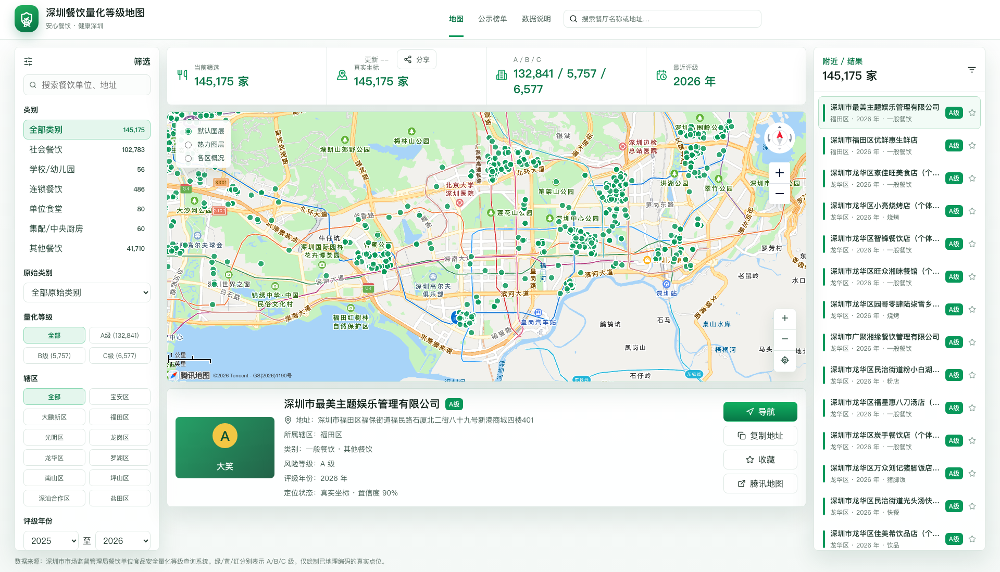
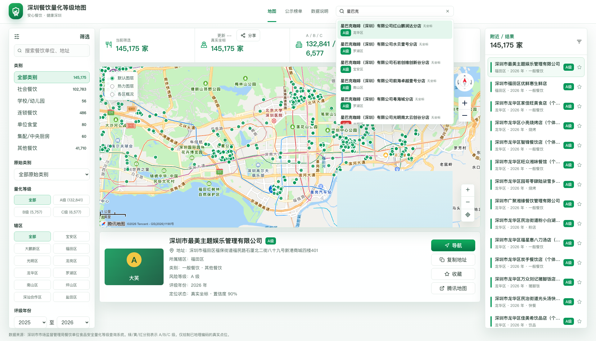

# 深圳餐饮量化等级地图

把深圳餐饮单位的食品安全量化评级放到地图上，按店名、地址、辖区和等级，查找身边的餐饮单位。

**[打开在线地图 →](https://wonderjz99.github.io/Food-sz/)** · [功能介绍](#功能介绍) · [本地运行](#本地运行) · [发布到-github-pages](#发布到-github-pages)



*实际网页截图。数据与地理编码进度会随更新变化。*

<details>
<summary>查看全局搜索示例</summary>



</details>

## 功能介绍

| 功能 | 可以做什么 |
| --- | --- |
| 地图浏览 | 用绿色 A、黄色 B、红色 C 标记查看不同量化等级，点击标记查看店名 |
| 全局搜索 | 按名称或地址搜索，支持 ↑ / ↓ 选择、Enter 确认、Esc 收起 |
| 条件筛选 | 按量化等级、餐饮类别、辖区、评级年份与关键词组合筛选 |
| 单位详情 | 查看等级、风险等级和地址，复制地址或打开腾讯地图导航 |
| 列表联动 | 点击右侧列表中的单位查看详情，通过定位按钮聚焦地图 |

全局搜索覆盖完整数据集；地图优先加载已完成地理编码的数据。缺少坐标的单位仍可被搜索，并显示“无坐标”。搜索索引在首次使用搜索框时按需加载。

## 数据说明

数据来自深圳市市场监督管理局餐饮单位食品安全量化等级公开查询系统（[数据来源网站](https://jg.amr.sz.gov.cn/)）。数据处理保留 2025 年起的评级，并按许可证编号等标识去重，保留最新记录。

截至本次文档更新（2026-10-09），本地构建快照包含：

| 指标 | 数量 |
| --- | ---: |
| 筛选、去重后的餐饮单位 | 166,419 |
| 已完成地理编码的餐饮单位 | 145,175 |
| 覆盖辖区 | 11 |

上述数字来自本地 `public/data/summary.json` 与 `summary-geo.json`，不代表实时统计；在线版本以实际发布的数据为准。量化等级反映来源系统的评级记录，最新信息请以监管部门公示为准。

## 本地运行

需要 Node.js 和 pnpm（项目声明版本为 `pnpm@11.7.0`）。

```bash
git clone https://github.com/wonderjz99/Food-sz.git
cd Food-sz
pnpm install
```

**首次克隆需要准备数据。** `data/`、`public/` 和本地 Key 文件均被 Git 忽略，安装依赖不会自动获得餐饮数据。

- 已有本地数据：准备 `data/parsed-ratings.json`；可同时放入 `data/geocode-cache.json`，保留已有坐标。
- 从头准备：按下方“数据更新”流程下载、筛选和解析数据，再执行地理编码。

构建前端数据并启动开发服务器：

```bash
pnpm run data:build
pnpm dev
```

浏览器打开 [http://127.0.0.1:5173](http://127.0.0.1:5173)，按 `Ctrl+C` 停止服务。

### 地图 Key 配置

在项目根目录创建 `key.txt`，按需要填写以下标签与对应 Key：

```text
food-sz-web:
你的腾讯地图 JavaScript API Web Key
food-sz-amap-geo:
你的高德 WebService Key
food-sz-geo:
你的腾讯 WebService Key（备用地理编码）
food-sz-geo-secret:
你的腾讯 secret/SK（如需签名）
```

日常浏览地图使用 `food-sz-web`；批量地理编码使用 WebService Key。腾讯地图 Web Key 如设置了域名限制，需要允许实际访问域名，线上为 `wonderjz99.github.io`。

也可在 `.env` 中设置 `VITE_TENCENT_MAP_WEB_KEY`，参考 [.env.example](.env.example)。Web Key 会随前端构建提供给浏览器，服务端 Key 和 secret/SK 应仅保存在本地。

## 数据更新

### 1. 下载、筛选和解析

```bash
pnpm run data:download-all
pnpm run data:filter-ratings
pnpm run data:parse-ratings
```

依次生成 `data/all-ratings.jsonl`、`data/filtered-ratings.jsonl` 和 `data/parsed-ratings.json`。

### 2. 地理编码

```bash
# 单批处理，按账户额度调整数量和请求间隔
pnpm run data:geocode-amap -- --limit=4000 --delay-ms=200

# 按日批处理
pnpm run data:geocode-daily

# 查看进度
pnpm run data:status
```

地理编码缓存保存在 `data/geocode-cache.json`，支持断点续传。每日脚本当前按每个 Key 最多 5,000 条、并发 5、间隔参数 200 ms 运行；支持 `foodsz-amap1` / `food-sz-amap-geo` 作为第一个 Key，`shenzhen-food` 作为第二个 Key。实际可用额度以地图服务账户为准，运行前可调整脚本参数。

### 3. 生成网页数据并检查

```bash
pnpm run data:build
pnpm run data:validate -- --strict-geocode
pnpm test
pnpm run build
```

注意：当前 `data:validate` 仍含旧版 4,522 条记录的固定数量检查，对当前全量数据会报数量不匹配；严格模式也会报告尚未完成地理编码的单位。该检查通过前需要先适配新的数据规模，不能直接据此判定下载数据损坏。生成文件包括：

| 文件 | 用途 |
| --- | --- |
| `public/data/units-geo.json` | 已完成地理编码的地图数据 |
| `public/data/summary-geo.json` | 地图数据的统计摘要 |
| `public/data/units.json` | 完整数据，作为地图加载的备用文件 |
| `public/data/summary.json` | 完整数据的统计摘要 |
| `public/data/search-index.json` | 全局搜索索引 |

## 发布到 GitHub Pages

在线地址：[https://wonderjz99.github.io/Food-sz/](https://wonderjz99.github.io/Food-sz/)

在准备好数据与地图 Web Key 的本地项目中运行：

```bash
pnpm run data:build
pnpm run build --base=/Food-sz/

# 发布分支使用单独的忽略规则，确保 data/ 被上传
printf '.DS_Store\n' > dist/.gitignore
pnpm dlx gh-pages -d dist --dotfiles --nojekyll
```

首次发布后，在 [Settings → Pages](https://github.com/wonderjz99/Food-sz/settings/pages) 中选择 **Deploy from a branch → gh-pages → / (root)**。

以后更新网页或数据，重新运行上述发布命令。发布需要本机已配置可推送该仓库的 GitHub 凭据。

### 数据加载失败时

1. 打开 [summary-geo.json](https://wonderjz99.github.io/Food-sz/data/summary-geo.json)，确认返回 JSON，而不是 404。
2. 若返回 404，检查 `gh-pages` 分支是否包含 `data/`。旧的源码 `.gitignore` 含有 `data/` 规则，会使发布时漏掉数据；使用上面的发布命令替换该规则。
3. 若数据存在，确认构建时使用 `--base=/Food-sz/`，并在部署完成后强制刷新页面。

## 技术栈与目录

React 18 · TypeScript · Vite 6 · 腾讯地图 JavaScript API GL · 高德 WebService Geocoder · Vitest

```text
src/
├── components/       # 搜索、筛选、地图、详情卡与单位列表
├── data/             # 数据加载、过滤、分类与地理编码工具
├── App.tsx           # 页面状态与组件联动
├── types.ts          # 数据类型
└── styles.css        # 页面样式
scripts/              # 下载、解析、地理编码、构建与验证脚本
tests/                # 数据管线与工具测试
docs/images/          # README 实际网页截图
data/                 # 本地原始数据与地理编码缓存（不提交）
public/data/          # 生成的网页数据（不提交到源码分支）
dist/                 # 前端构建产物，发布到 gh-pages
```
